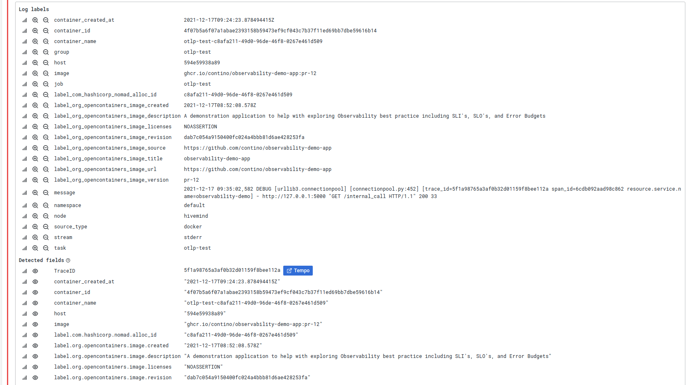
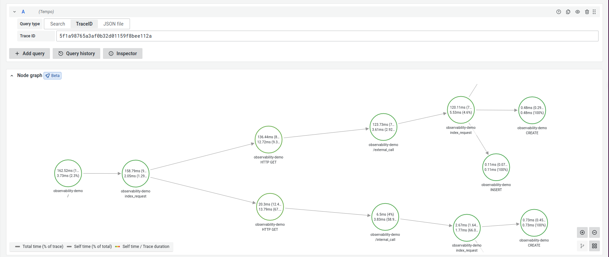

# observability-demo-app

A Python application to show the benefits of the [OpenTelemetry](https://www.opentelemetry.io) project.

## Deployment

### Docker

You can setup this container by editing `docker.env` to the appropriate values and running the following command:

```bash
docker run --env-file docker.env -P 5000:5000  ghcr.io/contino/observability-demo-app:latest
```

Logs will be sent to STDOUT by default, so you'll want to capture these somehow and send them on to your logging engine such as [Loki](https://grafana.com/oss/loki/), [Vector](https://vector.dev/), [Elasticsearch](https://www.elastic.co), or [FluentD](https://www.fluentd.org).

Traces will be sent to the OTLP endpoint specified in the environment file, and you can see the trace ID in the logs.

### Running locally/without Docker

If you don't want to use Docker, then you can follow these steps to get up and running

1. Create a virtualenv
2. Activate the virtualenv
3. Install the requirements: `pip install -r requirements.txt`
4. Set the `OBSDEMO_OTLP_ENDPOINT` environment variable to point to your OTLP collector
5. Set the `OBSDEMO_APP_SECRET` environment variable to the value you want to use for your app secret key
7. Alternatively, copy `.env.sample` to `.env`, update the values, and source it to setup the environment
8. Run the app `python app.py`

## Accessing the App

Once you have run the deployment steps, the app will be available available at [http://localhost:5000/](http://localhost:5000/), with metrics at [http://localhost:5000/metrics](http://localhost:5000/metrics).  

Point Prometheus at the `/metrics` endpoint, and then launch something like [apache bench](https://httpd.apache.org/docs/2.4/programs/ab.html) against the root:

```bash
ab -n 5000000 -c 5 http://localhost:5000/
```

## Dashboards

Once the Prometheus data is flowing, you can hook Grafana up and use [this dashboard](https://grafana.com/grafana/dashboards/9688) to view the data about the flask application.


## Tracing Data

Whilst the traces aren't anything particularly special, they will demonstrate the power of OpenTelemetry's tracing engine.

### In Grafana

Assuming that you have your log entries Loki and traces in Tempo, you should be able to [set up a derived field](https://grafana.com/docs/grafana/latest/datasources/loki/#derived-fields) as follows:


**Note**: Because we are using an "internal" data source, we can leave the `query` field set to `${__value.raw}`, there is no need for an additional URL.

Once this is set up, go to the `Explore` section and look at the logs for your app.  You should see that the records which contain a trace_id field now have a link to tempo:



If you click on the "Tempo" button, a new split window will open on the right of your screen showing you the traces


Finally, if you close the log data split and then click on the `Node Graph (beta)` button, you should see a map of the application calling out to external URLs and running various queries against an in-memory SQLite Database:



Unfortunately it is not possible at present to include this map into a dashboard due to [Grafana/43201](https://github.com/grafana/grafana/issues/43201), so if you want to view a map then you need to view the data in `Explore` mode.  We're hoping this can be fixed in due course!


### In AWS XRAY

Make sure that [AWS OpenTelemetry Collector](https://aws-otel.github.io/docs/getting-started/collector) is running somewhere, then update the `OBSDEMO_OTEL_ENDPOINT` to point to that location.  As long as your IAM policies are correct, your traces should start to show up in X-Ray


### Grafana Tempo

Ensure that the [OTLP Collector Distributor Configuration](https://grafana.com/docs/tempo/latest/configuration/#distributor) includes at least the following lines:

```yaml
# Distributor config block
distributor:

    # receiver configuration for different protocols
    # config is passed down to opentelemetry receivers
    # for a production deployment you should only enable the receivers you need!
    receivers:
        otlp:
            protocols:
                http:
```

Update the `OBSDEMO_OTEL_ENDPOINT` environment variable to point to your Tempo URL.  Make sure you add `v1/traces` to the end of the URL otherwise it won't work!

Once you start the App, you should be able to take a trace ID from the logs and use this in Grafana to view the trace.
