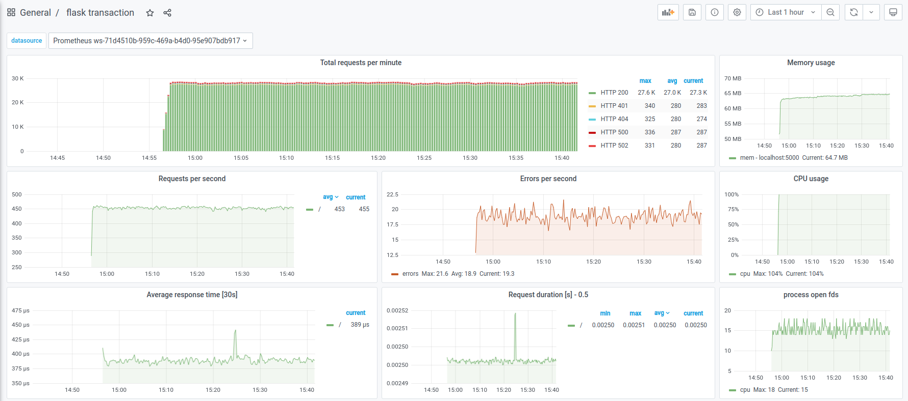
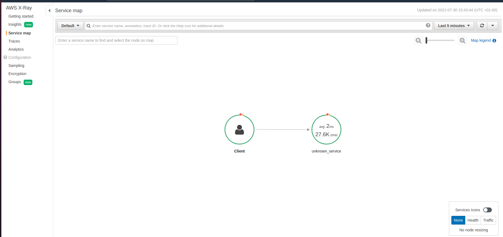

# observability-demo-app

A basic Python Flask application that randomly returns an HTTP error for 25% of queries.

By default, this works in AWS only and is configured to use X-Ray and Prometheus.

Prometheus should scrape the `/metrics` endpoint of this application

## Getting up and running

1. Create a virtualenv
2. Activate the virtualenv
3. Install the requirements: `pip install -r requirements.txt`
4. Set the `OBSDEMO_OTLP_ENDPOINT` environment variable to point to your OTLP collector
5. Set the `OBSDEMO_APP_SECRET` environment variable to the value you want to use for your app secret key
6. Assuming you're running in AWS, set `OTEL_PROPAGATORS=xray` to send traces to XRay
7. Alternatively, copy `.env.sample` to `.env`, update the values, and source it to setup the environment
8. Run the app `python app.py`

The app is now available at [http://localhost:5000/](http://localhost:5000/), with metrics at [http://localhost:5000/metrics](http://localhost:5000/metrics).  

Point Prometheus at the `/metrics` endpoint, and then launch something like [apache bench](https://httpd.apache.org/docs/2.4/programs/ab.html) against the root:

```bash
ab -n 5000000 -c 5 http://localhost:5000/
```

## Dashboards

Once the Prometheus data is flowing, you can hook Grafana up and use [this dashboard](https://grafana.com/grafana/dashboards/9688) to view the data.



## AWS X-Ray

Whilst the traces aren't anything particularly special, they will prove whether your X-Ray setup is working.

Make sure that [AWS OpenTelemetry Collector](https://aws-otel.github.io/docs/getting-started/collector) is running somewhere, then update the `OBSDEMO_OTEL_ENDPOINT` to point to that location.  As long as your IAM policies are correct, your traces should start to show up in X-Ray


